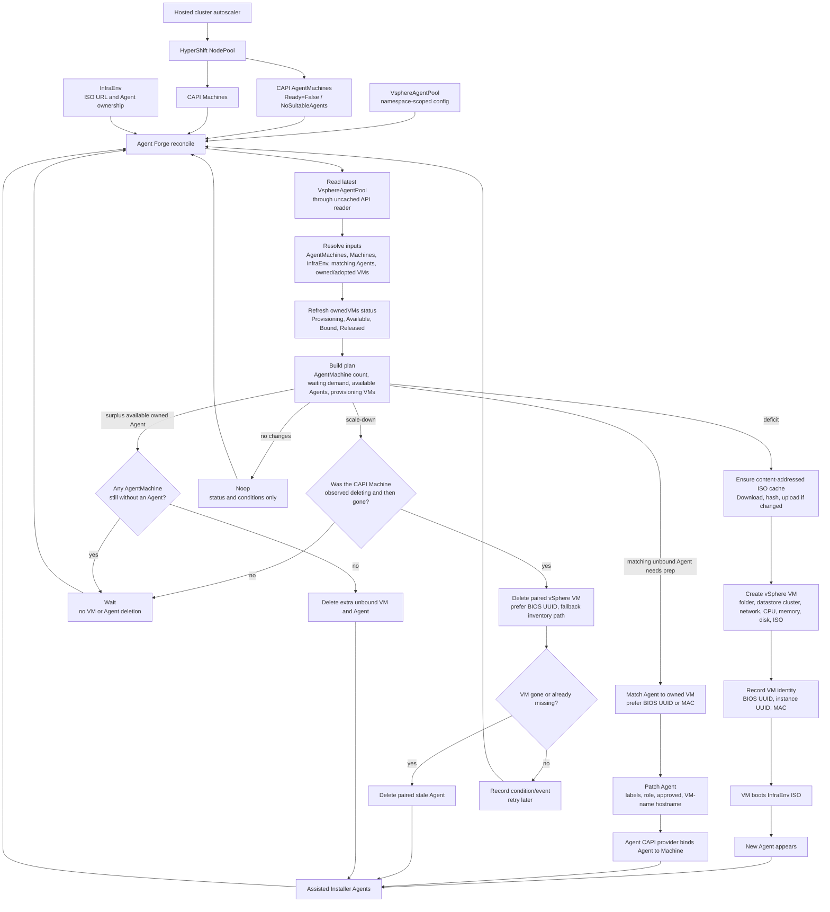

# agent-forge-operator

Agent Forge Operator bridges hosted-cluster autoscaling to VM capacity for
HyperShift Agent platform clusters on vSphere.

HyperShift and CAPI remain the source of truth. Agent Forge watches the
`AgentMachine` objects rendered for a HyperShift `NodePool`; when they report
`Ready=False` with `Reason=NoSuitableAgents`, it creates vSphere VMs so matching
Assisted Installer `Agent` objects can appear.

## What It Does

- Watches a namespace-scoped `VsphereAgentPool` custom resource.
- Watches CAPI `AgentMachine` demand for one HyperShift `NodePool`.
- Creates capacity only for `AgentMachine` objects waiting on
  `NoSuitableAgents`.
- Creates vSphere VMs from an `InfraEnv` discovery ISO when more Agents are
  needed.
- Optionally approves matching Assisted Installer `Agent` objects.
- Deletes only owned VMs and stale unbound Agents when scale-down is allowed.
- Reports status conditions, planned actions, and Kubernetes Events for
  operational visibility.

## Current Scope

Agent Forge is designed for OpenShift environments that use:

- HyperShift hosted clusters on the Agent platform.
- Assisted Installer `InfraEnv` and `Agent` resources.
- CAPI `AgentMachine` and `Machine` resources rendered for hosted cluster NodePools.
- vSphere as the VM provider.

It does not replace the hosted cluster autoscaler and does not scale NodePools
directly. It reacts to AgentMachine demand that already exists.

## How It Works



The reconciliation loop is driven by watches on `VsphereAgentPool`,
`AgentMachine`, `Machine`, and matching `Agent` objects. That means new
NoSuitableAgents demand, Machine deletion, and newly discovered Agents are
handled immediately instead of waiting only for the periodic requeue.
At the beginning of each reconcile, the controller reads the
`VsphereAgentPool` through the uncached API reader so create/delete planning is
based on the latest recorded `ownedVMs` status instead of stale informer state.

Scale-up is demand driven. The controller counts `AgentMachine` objects for the
NodePool that report `Ready=False` with `Reason=NoSuitableAgents`, subtracts
available matching Agents and already-provisioning owned VMs, and records the
remaining demand in status. The AgentMachine controller creates a
`VsphereAgent` for each waiting AgentMachine; each `VsphereAgent` then creates a
vSphere VM that boots the active InfraEnv ISO. The controller records the
vSphere BIOS UUID, instance UUID, and primary MAC address immediately after VM
creation. When the Agent appears, it is matched to the owned VM by BIOS UUID or
MAC before any hostname fallback. The controller then applies the configured
labels, role, approval, and VM-name hostname so the Agent CAPI provider can bind
it to a Machine.

Existing clusters are adopted through Agents. If a matching Agent already
exists, the controller records it in `status.ownedVMs` using the Agent hostname,
MAC address, and VMware BIOS UUID from inventory. If a matching owned VM already
has a recorded BIOS UUID or MAC address, that identity wins over list order or
hostname fallback. Bound Agents are marked `Bound`; unbound prepared Agents are
marked `Available`; Agents that were previously bound and then returned by CAPI
are marked `Released`.

Scale-down is deliberately conservative. The controller does not choose random
VMs. It first observes a paired CAPI `Machine` entering deletion, waits until
that Machine has disappeared, and only then deletes the paired VM and stale
Agent. While a Machine is deleting, the last known `machineRef` is retained in
status so the VM can transition from `MachineDeleting` to `MachineDeleted` once
the Machine disappears. VM deletion prefers the VMware BIOS UUID and falls back
to the full inventory path. A missing VM is treated as already deleted so the
stale Agent can still be removed.

## Installation

Install the latest release manifests:

```sh
kubectl apply -f https://github.com/containeroo/agent-forge-operator/releases/download/v0.0.12/crds.yaml
kubectl apply -k github.com/containeroo/agent-forge-operator//config/default?ref=v0.0.12
```

The published manager images are:

```text
ghcr.io/containeroo/agent-forge-operator:v0.0.12
containeroo/agent-forge-operator:v0.0.12
```

For a local image build:

```sh
make docker-build docker-push IMG=<registry>/agent-forge-operator:<tag>
make deploy IMG=<registry>/agent-forge-operator:<tag>
```

## Getting Started

Start with [docs/getting-started.md](docs/getting-started.md). It covers the
required cluster objects, vSphere Secret, `VsphereAgentPool`, status
inspection, and active VM reconciliation.

For the complete CRD field contract and status model, see
[docs/vsphereagentpool-crd.md](docs/vsphereagentpool-crd.md).

## Example

```yaml
apiVersion: agent-forge.containeroo.ch/v1alpha1
kind: VsphereAgentPool
metadata:
  name: demo-worker
  namespace: demo
spec:
  hostedClusterRef:
    name: demo
  nodePoolRef:
    name: demo-worker
  infraEnvRef:
    name: demo
  controlPlaneNamespace: demo-demo
  vsphere:
    credentialsSecretRef:
      name: vsphere-credentials
    datacenter: dc1
    datastoreCluster: workload-datastore-cluster
    isoDatastore: iso-datastore
    resourcePool: cluster/Resources
    folder: demo
    network: VM Network
  template:
    namePrefix: demo-worker
    numCPUs: 4
    memoryMiB: 16384
    diskGiB: 100
  agent:
    role: worker
    approve: true
    labels:
      agentclusterinstalls.extensions.hive.openshift.io/location: lab-a
      customer: example
      hypershift.openshift.io/nodepool-role: worker
  iso:
    checkInterval: 10m
    retainVersions: 2
    pathPrefix: agent-forge/demo/demo-worker
```

The controller caches the InfraEnv discovery ISO by content digest. It downloads
and hashes the ISO at `spec.iso.checkInterval`, uploads a new `<sha256>.iso`
object only when the bytes changed or the datastore object is missing, and
inserts the active `status.iso.path` into every new VM. To force an immediate
refresh, annotate the CR with
`agent-forge.containeroo.ch/force-iso-refresh=<unique-value>`.

## Development

Requirements:

- Go 1.26 or newer.
- `kubectl` or `oc`.
- Docker or another compatible container tool.
- Access to a Kubernetes or OpenShift cluster for deployment tests.

Common commands:

```sh
make test
make lint
make manifests
make crd
make deploy IMG=<registry>/agent-forge-operator:<tag>
```

Run locally against the active kubeconfig:

```sh
make install
make run
```

The controller uses `govc` for vSphere operations. The container image includes
`govc`; local `make run` expects `govc` at `/usr/local/bin/govc` unless
`GOVC_PATH` is set.

## Release

Releases are built by GoReleaser from pushed tags:

```sh
git tag v0.0.12
git push origin v0.0.12
```

The release workflow publishes multi-architecture images to GHCR and DockerHub
and attaches `crds.yaml` to the GitHub release.

## License

Licensed under the Apache License, Version 2.0. See [LICENSE](LICENSE).
